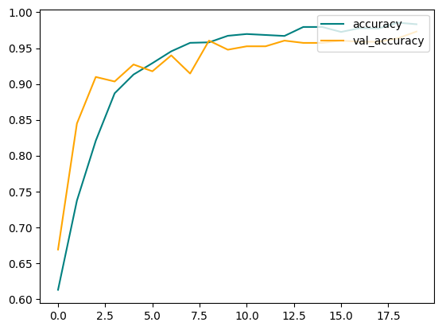
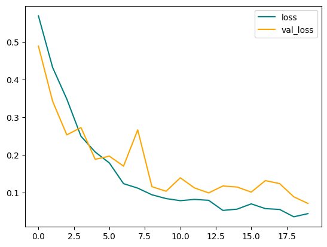
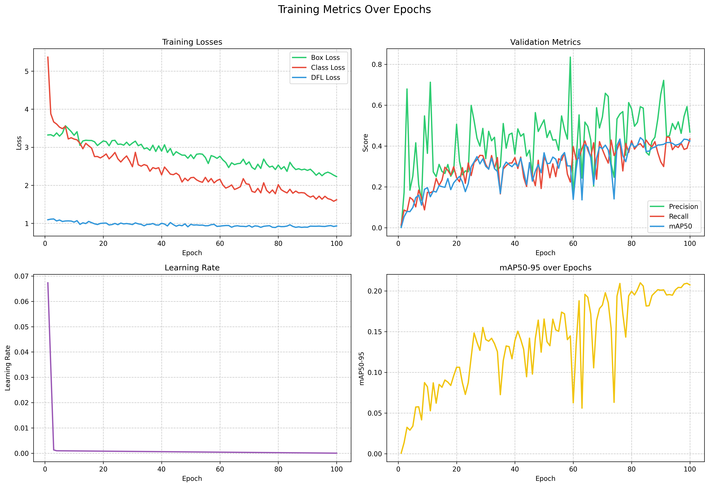
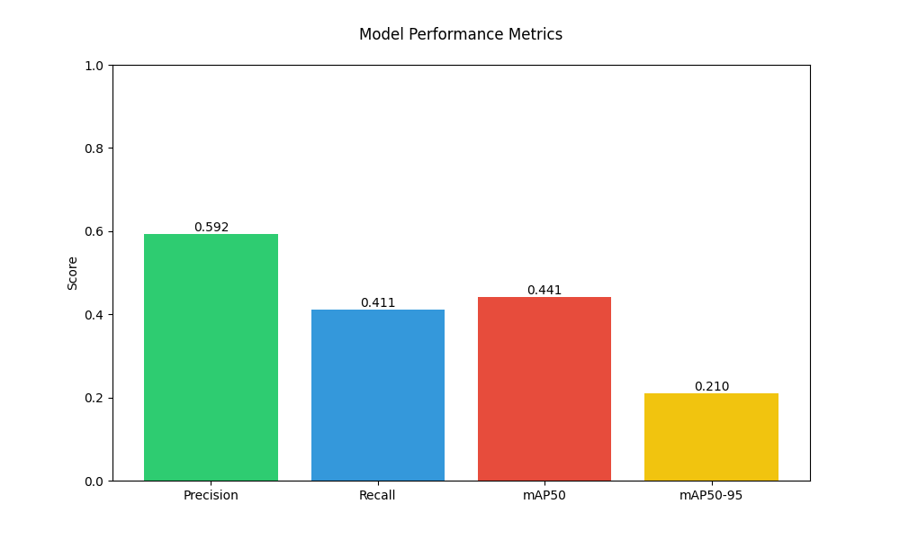

# AIMLForHealthcare
AI/ML models and algorithms for various healthcare related problems: e.g. detection of lung cancer from CT scans.

# Models
- [CNN](models/cnn) - Convolutional Neural Network for lung cancer detection from CT scans.
- [YOLO](models/yolo) - You Only Look Once (YOLO) model for lung cancer detection from CT scans.

# Model Outputs
- [Model Outputs](model_outs) - Predictions and visualizations for the trained models.

## CNNs

## YOLO

